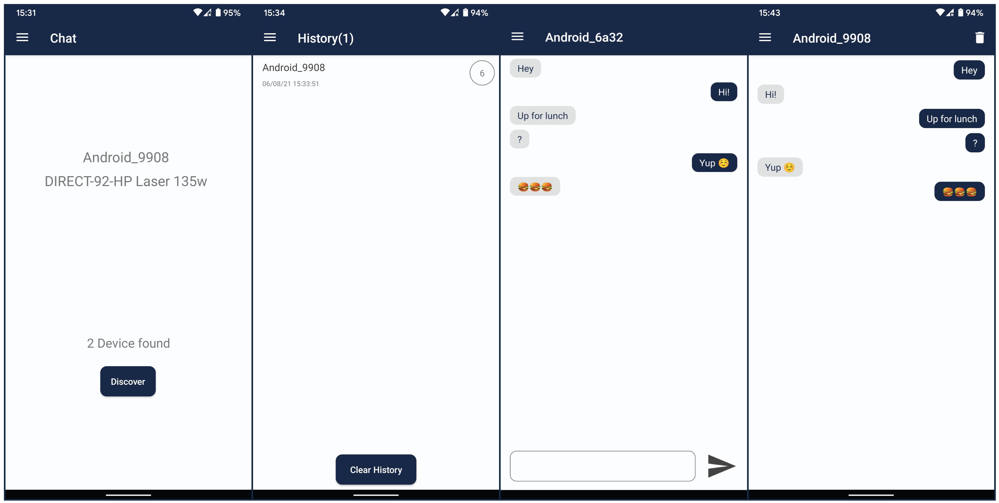

### Wifi Direct Chat
### Android Final Project for MACS, Free University of Tbilisi

Nodar Sanaia   (nsana15@freeuni.edu.ge)
Vache Katsadze (vkats15@freeuni.edu.ge)

### About
The main page of the application is a list of chats, from which it is possible to go to the chat page or delete the chat itself.

When selecting chat in the navigation drawer, there is the peer search page, 
where when you open the page, you first ask for the permission of the location 
above Android M and if necessary, application warns the device that the 
location/WIFI is disconnected and offers to turn it on.

Then you can find the devices on the network, contrary to the request, 
our application can connect to any device on the network.

After connecting, the chat is created, we have an asymmetric connection 
where one is server and the other is client, in other words, one creates
a ServerSocket which is a Group Owner, the server calls accept for the 
client-created socket and then corresponds. All of this is working in 
separate thread so that the main thread is not loaded,

Because of the fact that our app is designed to contact many users after
the conversation is over, disconnect is done from the relevant direct and
group and allows users to connect to other devices on the network as well.

Due to asymmetry, only the server can disconnect, and in case of first 
client wants to leave the conversation, it sends the server keyword 
"TAVZARIKO777", after which the server disconnects.

Application is tested and works on following SDK: 21/23/26/28

